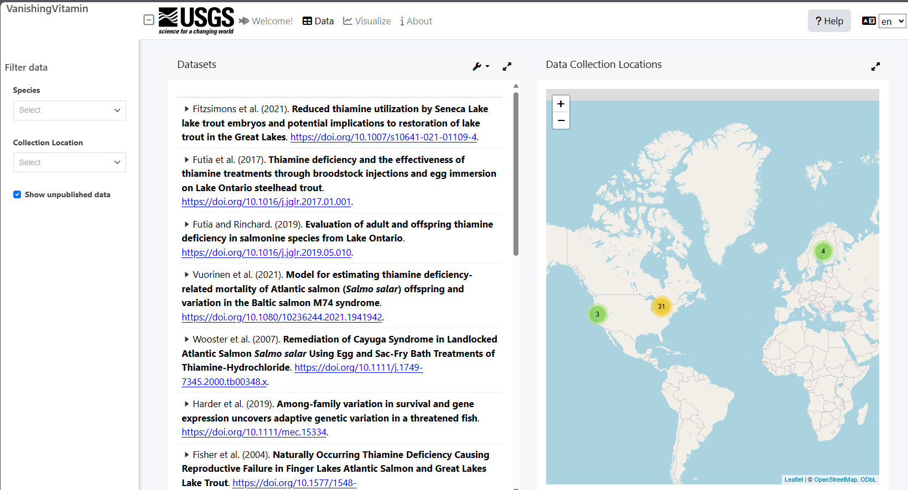
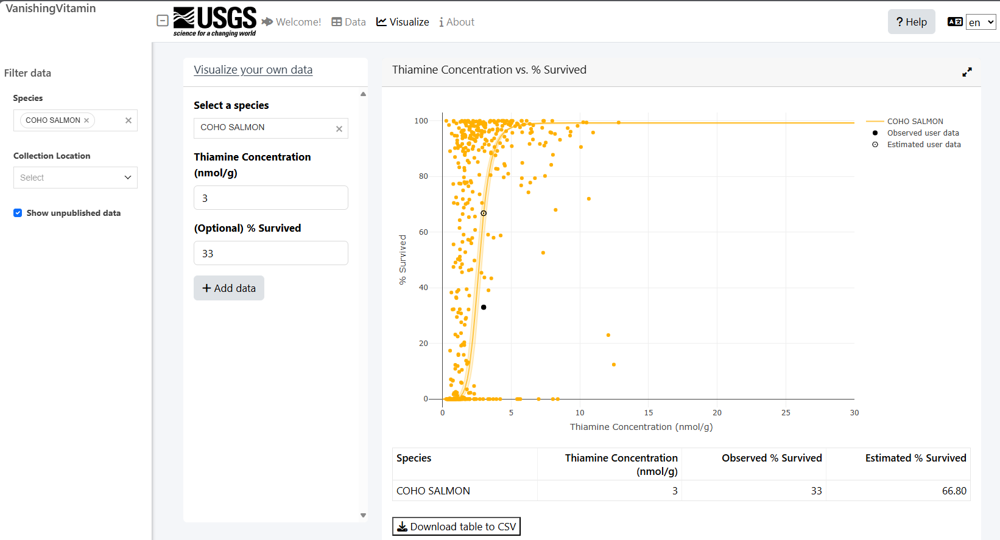

# VanishingVitamin Thiamin Deficiency Complex app

**Authors**: Joseph Zemmels, Matthew Futia, Freya Rowland, Miles Davis

**Point of contact**: Joseph Zemmels (<jzemmels@usgs.gov>)

**Year of Origin**: 2025

**Year of Version**: 2025

**Digital Object Identifier (DOI)**: in-progress

**USGS Information Porudct Data System (IPDS) no.**: in-progress

**Statement of Need**: Thiamin Deficiency Complex (TDC) is a global threat to the stability and persistence of wildlife populations. 
The purpose of this application is to assemble a publicly accessible and interactive database on Thiamin Deficiency Complex in salmonids.

------------------------------------------------------------------------

The code in this repository was mostly written in the [R](https://cloud.r-project.org/) programming language within the [RStudio](https://posit.co/download/rstudio-desktop/) integrated development environment (IDE).
It uses [git](https://git-scm.com/) for version control.
See [Happy Git with R](https://happygitwithr.com/) for an R-centric introduction to git.

The following sections cover instructions for accessing the app and interacting with the repository as a [User](https://github.com/VanishingVitamin/tdc_shiny_app?tab=readme-ov-file#im-a-user-accessing-the-app), [Reviewer](https://github.com/VanishingVitamin/tdc_shiny_app?tab=readme-ov-file#im-a-reviewer-providing-feedback), and [Developer](https://github.com/VanishingVitamin/tdc_shiny_app?tab=readme-ov-file#im-a-developer-making-changes).

## Overview

Thiamine Deficiency Complex (TDC) threatens the stability and persistence of wildlife populations.
This Shiny application provides a publicly accessible, interactive database of thiamine concentrations and mortality in salmonids.

### App Features
* **Welcome tab** – Background and usage info.
* **Data tab** – Table and map of published thiamine data, filterable via sidebar controls.  
  
* **Visualize tab** – Interactive scatterplot of thiamine concentration vs. mortality.  
  You can also upload and plot your own data.  
  

---

## Tech Stack

* **Language:** [R](https://cloud.r-project.org/)  
* **IDE:** [RStudio](https://posit.co/download/rstudio-desktop/)  
* **Version control:** [git](https://git-scm.com/)  
* **Helpful primer:** [Happy Git with R](https://happygitwithr.com/)

This README has separate guidance for [Users](#users), [Reviewers](#reviewers), and [Developers](#developers).

---

## Users

Access the app at **<https://rconnect.usgs.gov/vanishing-vitamin-app/>** – no installation required.

---

## Reviewers

Thank you for providing feedback!

### Run the app locally
1. Install [R](https://cloud.r-project.org/) and [RStudio](https://posit.co/download/rstudio-desktop/).  
2. Install [git](https://git-scm.com/).  
3. Clone the repo:
```bash
git clone https://github.com/VanishingVitamin/tdc_shiny_app.git
```
(SSH users: `git clone git@github.com:VanishingVitamin/tdc_shiny_app.git`)

4. Open `tdc_shiny_app.Rproj` in RStudio.
5. Install **devtools** in R:
```r
install.packages("devtools")
```
6. Install the package:
```r
devtools::install(".")
```
(**Note:** if install fails due to missing packages, try running `devtools::install_deps()`.)

7. Launch the app:
```r
vanishingVitamin::launch_app()
```

### Code review
Major changes use GitHub [pull requests](https://docs.github.com/en/pull-requests).
See [Reviewing proposed changes](https://docs.github.com/en/pull-requests/collaborating-with-pull-requests/reviewing-changes-in-pull-requests/reviewing-proposed-changes-in-a-pull-request) and [Better, faster code reviews](https://github.com/mawrkus/pull-request-review-guide) for tips.

---

## Developers

Welcome!
Follow the **“Run the app locally”** steps above first.

### App Structure
The Shiny app lives inside an R package called **`vanishingVitamin`**. 
Launch with `vanishingVitamin::launch_app()`.

Key files in `R/`:

* **app_ui.R** – UI definition (`bs4Dash::dashboardPage()`).
* **app_server.R** – Main server logic, split into `data_tab_server.R`, `visualize_tab_server.R`, and `translation_server.R`.
* **app_theme.R** – Custom theme (`fresh::create_theme()`).
* **run_app.R** – Source for `launch_app()`.
* **publish_app.R** – Publishes to [Posit Connect](https://rconnect.usgs.gov/vanishing-vitamin-app/).
* **datasets.R** – Package-data documentation.
* **globals.R** – Misc. variables to suppress R warnings.

Reload the package while developing with `Ctrl/Cmd + Shift + L` or `devtools::load_all()`.

Helpful references:

* [Mastering Shiny: Packaging Apps](https://mastering-shiny.org/scaling-packaging.html)  
* [R Packages – Development Workflow](https://r-pkgs.org/workflow101.html)

---

### Updating Data
The package exports three datasets:

| Dataset | Source script | Notes |
|--------|--------------|------|
| `tdc_data` | `inst/construct_tdc_dataset.R` | Cleaned data from [source spreadsheet](https://docs.google.com/spreadsheets/d/1TX5lkpAsdurQlWQoNAmKWHv4WBoPwjmq/edit?usp=sharing). |
| `citations` | `inst/construct_citations_metadata.R` | Metadata for `tdc_data`. |
| `dose_response_params` | `inst/construct_dose_response_params.R` | Fitted dose-response parameters. |

Update workflow:
1. Edit the relevant `inst/construct_*` script.
2. Run the script to regenerate objects and write to `inst/misc_data/`.
3. Verify the objects in R.
4. Save into the package:
```r
usethis::use_data(tdc_data, overwrite = TRUE)
```
(repeat for the other datasets)

5. Reload (`devtools::load_all()`) and launch to confirm.
6. Update documentation in `R/datasets.R` if needed.

---

### Updating Translations

#### Welcome / Help Pages

* Source `.qmd` files in `www/welcome_page/`  
* Render to `.html` using RStudio’s **Render** button or (as an example):

```r
quarto::quarto_render("www/welcome_page/welcome_page_es.qmd")
```

#### UI Labels

* Translation CSVs live in `www/translations/` (English → Spanish, Finnish, Swedish).
* UI labels use `shiny::uiOutput()` and are rendered in `R/translation_server.R` with `shiny::renderUI()` and [`shiny.i18n`](https://appsilon.github.io/shiny.i18n/).

To add a new translatable label:

1. Add a `uiOutput("tab_element_translation", inline = TRUE)` in `app_ui.R`.
2. Add a matching `output$tab_element_translation` in `translation_server.R`.
3. Add the translation to each CSV:

```
New text,Texto nuevo
```

4. Reload and test.

---

### Git/GitHub Workflow
Typical branch-based workflow:

1. Create a new branch:
```bash
git checkout -b my-feature
```
2. Make changes, commit frequently (`git add`, `git commit`).
3. Pull remote updates if collaborating:
```bash
git pull
```
4. Push branch:
```bash
git push -u origin my-feature
```
5. Open a [Pull Request](https://docs.github.com/en/pull-requests).
6. Request review, address feedback, and merge to `main`.
7. Update local main:
```bash
git checkout main
git pull
```

Reference: [Happy Git with R](https://happygitwithr.com/).

---

### Publishing the app

The app is publicly hosted on a platform called [Posit Connect](https://docs.posit.co/connect/user/) (ran by the same company that develops RStudio and the `tidyverse` packages).
The following section outlines an automated method for publishing updated to the app.
If this fails, feel free to reach out to Joe (jzemmels@usgs.gov), who can publish the app using other means.

#### Automated app publishing via GitHub Actions 

The VanishingVitamin app is automatically deployed to Posit Connect when changes are merged into the `main` branch.

* A [GitHub Actions](https://docs.github.com/en/actions/get-started/understand-github-actions) workflow (`.github/workflows/deploy.yml`) runs on every push to `main`.
* It installs dependencies, builds the package, and calls `R/publish_app.R` to deploy the app.
* Deployment credentials (server URL, account name, API key) are stored securely as **GitHub repository secrets**, so personal credentials are never exposed in the repository.

You do not need to run deployment manually.
Any approved changes merged to `main` will trigger the workflow and update the live app automatically.

For reference, the workflow uses the following secrets, which must be configured by maintainers (Joe) in GitHub:
* `PC_SERVER` – Posit Connect server URL (e.g., `https://rconnect.usgs.gov`)
* `PC_ACCOUNT` – Posit Connect account name
* `PC_API_KEY` – API key for authentication

## Disclaimer

This software is preliminary or provisional and is subject to revision. 
It is being provided to meet the need for timely best science. 
The software has not received final approval by the U.S. Geological Survey (USGS). 
No warranty, expressed or implied, is made by the USGS or the U.S. Government as to the functionality of the software and related material nor shall the fact of release constitute any such warranty. The software is provided on the condition that neither the USGS nor the U.S. Government shall be held liable for any damages resulting from the authorized or unauthorized use of the software.

**Note:** formatting of this document was aided by ChatGPT.
