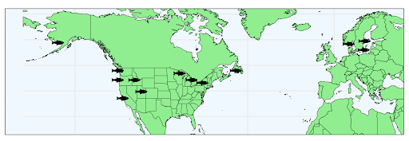

**Thiamine** (vitamin B1) is essential to almost all life on Earth. 
As such, thiamine is needed for cells to make energy and function normally. 
Thiamine is made by plants and microbes, but most animals have to eat food with thiamine to have enough for their bodies. 
Thiamine is water-soluble, meaning that any extra will be excreted (eliminated in urine) and cannot be stored. 
As such, animals need a constant input of thiamine from their food. 
**Thiamine deficiency complex** (TDC) is a nutritional deficiency of thiamine that causes a range of problems including neurological problems (loss of balance, confusion) and even death. 
Thiamine deficiency is interestingly both an ancient human malady and an emerging global threat to fish and wildlife. 
Thiamine deficiency, called ‘beriberi’ in humans, has a long history; it was first described between 300–2700 BCE in The Yellow Emperor’s Classic of Medicine. 
TDC was found in livestock and farming operations in the early 20th century, and has also been found in alligators, fish, mollusks, moose, and birds. 

{width="50%" align="center" style="border: 2px solid #eeeeee"}

{width="50%" align="center" style="border: 2px solid #eeeeee"}

TDC — also known as early mortality syndrome (EMS) and M74 — has been widely diagnosed and studied within salmon and trout, where it is considered a threat to global fishery stability. TDC has affected salmonid populations in the Laurentian Great Lakes, Lake Champlain, the New York Finger Lakes, and the Baltic Sea. It is characterized by a low amount of thiamine transferred into eggs from a spawning female that then results in issues and even death while the larval fish (called alevin in salmon) don’t have enough thiamine to thrive before they can get thiamine from their food.

