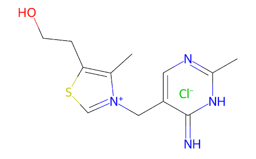
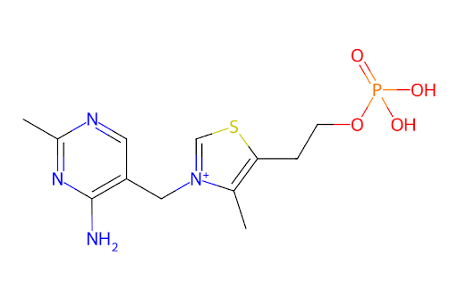
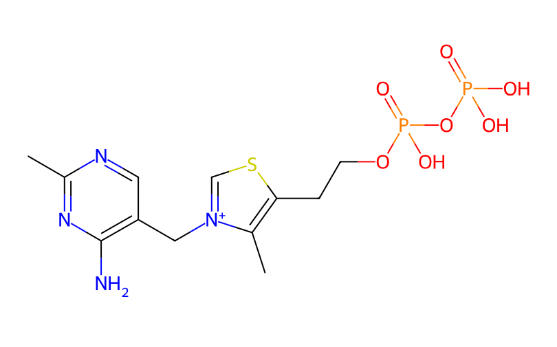

What is a vitamer? 
Vitamers are forms of the vitamin. 
Thiamine that is used by cells needs to be phosphorylated – that is, have one or two phosphate groups.

For species that have a long time living off of their yolk sac, most of the thiamine will be in free thiamine. 
Free thiamine is not readily used by organisms, but is good for storage until it is needed.

{width="50%" align="center" style="border: 2px solid #eeeeee"}

The thiamine that is used by our bodies (and the fish) are the phosphorylated thiamines. 
There are two forms: thiamine monophosphate and thiamine pyrophosphate.

{width="50%" align="center" style="border: 2px solid #eeeeee"}

{width="50%" align="center" style="border: 2px solid #eeeeee"}

Thiamine degrades easily when pH is basic, in the presence of UV light, and in warm temperatures. It is a water-soluble vitamin, meaning that for the most part, there is no way to store excess thiamine and anything that is not used is excreted in urine. To remain thiamine replete
