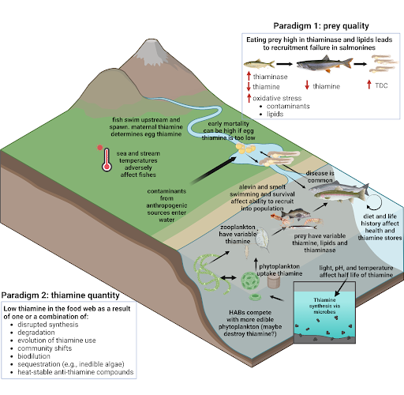

The short answer? It’s complicated.

TDC in fish, wildlife, and humans occurs by not getting enough thiamine through food. This can occur by eating food that doesn’t have enough thiamine, or by having thiamine destroyed in the body due to oxidative stress or thiaminolytic enzymes (thiaminase). Thiaminases are enzymes present in certain microbes, plants, insects, invertebrates, and even vertebrate species, including many fishes. Importantly, salmon prey high in thiaminases destroy thiamine as the salmon digest them. The link between a thiaminase-rich diet and TDC has occurred in humans, livestock, fur farm animals, Pacific harbor seals (Phoca vitulina), and fish. Widespread TDC in Great Lakes salmon has been linked to eating invasive, thiaminase-rich alewife (Alosa pseudoharengus) while studies of TDC in Baltic Sea Atlantic salmon point to diets that are low in thiamine and high in unsaturated fat such as sprat (Sprattus sprattus), which uses thiamine by increasing oxidative stress.

{width="50%" align="center" style="border: 2px solid #eee"}

